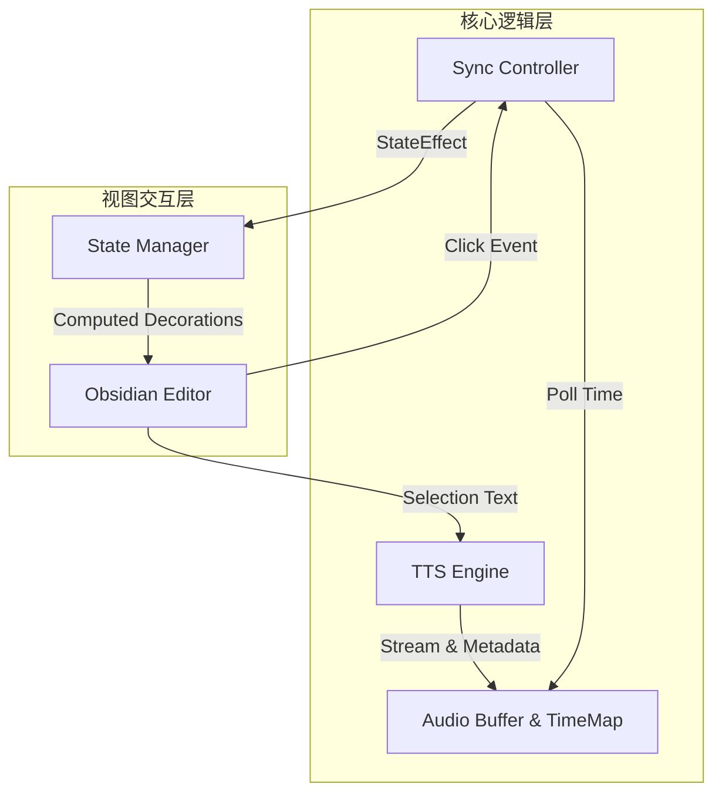

# VoxTrack 开发规范

> [!IMPORTANT]
> 本文档是 `VoxTrack` 项目的 **唯一事实来源 (Single Source of Truth)**。所有代码必须严格遵守本文档定义的约束和架构。

## 0. 项目概述

### 0.1 项目目标

`VoxTrack` 是一个 **Obsidian 文本转语音 (TTS) 增强插件**，旨在提供接近真人音质的朗读体验，并实现精细的阅读跟踪。

**核心目标**:

* **[真人音质体验]**: 集成微软 Edge TTS 引擎，提供如“晓晓”、“云希”等高质量、自然的语音合成服务。
* **[实时高亮追踪]**: 利用 WebSocket 获取的时间戳元数据，实现**单词 (Word)** 或 **句子 (Sentence)** 级别的实时高亮跟随。
* **[原生无损交互]**: 深度集成 CodeMirror 编辑器，通过装饰器 (Decoration) 实现高亮，**绝不修改用户 Markdown 源码**；支持点击跳转、自动滚动等交互。

### 0.2 核心价值主张

1. **[沉浸式听读]**: 结合高质量语音与精确的视觉引导，显著提升长文阅读、校对和语言学习的效率与体验。
2. **[精准同步]**: 相比传统基于语速估算的同步方案，通过 Metadata 实现**毫秒级**音画同步，解决不同语速下的错位问题。
3. **[非破坏性]**: 坚持“数据安全第一”，所有视觉效果均为渲染层 overlay，确保笔记数据的纯净与安全。

## 1. 工程约束

### 1.1 技术栈

* **语言**: TypeScript (Target: ES2020+)
* **核心库**:
  * `CodeMirror 6` (@codemirror/view, @codemirror/state): Obsidian 编辑器底层 API，核心高亮实现依赖。
  * `WebSocket` (Native API / `ws`): 用于与 Edge TTS 服务建立长连接。
  * `Intl.Segmenter` (Native API): 用于高性能、符合语言习惯的本地文本断句。

* **测试**: Jest (单元测试) + Obsidian E2E (手动验收)
* **Linting**: ESLint + Prettier (遵循 Standard JS 规范)

### 1.2 编码原则

1. **[无损渲染原则]**:
   * **[具体实践方法]**: 严禁直接操作 DOM 或修改 Markdown 文档内容来实现高亮。所有高亮必须通过 CodeMirror 的 `StateField` 和 `Decoration` 机制实现。
   * **[配套要求]**: `unload` 时必须彻底清除所有编辑器装饰器。

2. **[性能敏感原则]**:
   * **[High Frequency]**: 音频同步循环使用 `requestAnimationFrame` (rAF) 而非 `setInterval` 或 `timeupdate` (后者频率仅~4Hz，不够平滑)。
   * **[View Optimization]**: 在 `Extension` 中限制重绘范围，仅计算和更新 Viewport 可见区域的 Decorations。

3. **[鲁棒性与容错]**:
   * **[容错级别]**: 网络波动或 TTS 服务不可用时，应降级为单纯的播放失败提示，**绝不允许导致 Obsidian 崩溃或卡死**。
   * **[异常隔离]**: TTS 连接模块应独立于主线程 UI，建议考虑 Web Worker (如果计算量大) 或严格的异步处理。

## 2. 系统架构

系统遵循 **[MVVM / 响应式]** 架构思路，数据流单向驱动视图更新。



* **Data Layer (TTS Engine)**: 负责协议适配 (Edge TTS Protocol)、WebSocket 通信、音频流解码及元数据解析。
* **Control Layer (Sync Controller)**: 系统的“指挥家”。维护播放状态，通过 `rAF` 循环比对 `AudioContext.currentTime` 与 `TimeMap`，计算当前活跃的文本 Range。
* **View Layer (Editor Integrator)**: 封装 CodeMirror 插件逻辑。接收 Control 层发出的状态变更 (`StateEffect`)，更新 `StateField`，最终映射为编辑器的 CSS Classes。

## 3. 核心模块规范

### 3.1 `TTS Engine` (语音合成引擎)

**职责**: 处理与微软 Edge TTS 服务器的所有交互。

* **数据结构**:
```typescript
interface AudioMetadata {
    offset: number;    // 音频时间偏移 (100ns units)
    duration: number;  // 持续时间
    text: string;      // 对应文本
    textOffset: number;// 文本在原文中的 Char Index
    wordLength: number;// 单词长度
}
```

* **行为**:
  1. **握手**: 建立 WebSocket 连接，发送必要的配置头 (SpeechConfig)。
  2. **请求**: 构建 SSML (Speech Synthesis Markup Language)，确保请求包含 `wordBoundary` 事件以便获取时间戳。
  3. **流处理**:
     * 二进制帧 -> 拼接/解码 -> `AudioBuffer`
     * 文本帧 -> JSON Parse -> `AudioMetadata[]`

* **约束**:
  * **协议闭源挑战**: 需参考开源社区 (如 `edge-tts`) 实现握手逻辑，注意 Generating Request ID (UUID)。
  * **长文本处理**: 必须实现**分段策略** (Chunking)，每次请求不超过限制字符数 (e.g. 2-3 段落)，并实现预加载队列以保证连贯播放。

### 3.2 `Sync Controller` (同步控制器)

**职责**: 协调播放器时间和编辑器高亮位置。

* **逻辑 (核心算法)**:
  * **二分查找**: 在 `requestAnimationFrame` 循环中，使用二分法在有序的 `AudioMetadata` 数组中查找当前 `currentTime` 对应的数据项。
  * **Buffer 对齐**: 解决网络延迟造成的音画不同步，确保开始播放的时间点与 Buffer 头部的时间戳对齐。
  * **状态机**: 维护 `Idle`, `Buffering`, `Playing`, `Paused` 状态。

### 3.3 `Editor Renderer` (渲染器)

**职责**: 将同步控制器的输出转化为视觉效果。

* **关键组件**:
  * `activeWordField`: 一个 CodeMirror `StateField`，存储当前的 `SelectionRange` (Start, End)。
  * `highlightTheme`: `EditorView.theme`，定义高亮的样式 (背景色、下划线等)。

* **持久化/输出**:
  * 无持久化数据，所有状态运行时存在内存中。

## 4. 数据与配置

### 4.1 配置文件

使用 Obsidian 提供的 `Plugin.loadData()` 读取 `data.json`。

**Settings Interface**:
```typescript
interface VoxTrackSettings {
    // TTS 设置
    voice: string;        // 语音角色, e.g., "zh-CN-XiaoxiaoNeural"
    rate: string;         // 语速, e.g., "+0%"
    pitch: string;        // 语调, e.g., "+0Hz"
    volume: string;       // 音量
    
    // 交互设置
    autoScroll: boolean;  // 播放时是否自动滚动视口
    highlightMode: 'word' | 'sentence' | 'none'; // 高亮模式
    clickToPlay: boolean; // 是否启用点击 gutter 跳转播放
}
```

### 4.2 运行时状态

* **Timestamp Map**: `Map<AudioTime, TextOffset>`，用于快速检索。
* **Audio Queue**: 待播放的音频片段队列。

## 5. 领域特定规范

### 5.1 Edge TTS 协议适配

* **握手格式**: 严格遵守 Edge TTS 的 WebSocket 消息格式，包含 Headers (`X-Timestamp`, `Content-Type`)。
* **Request ID**: 每个 SSML 请求必须生成唯一的 `X-RequestId`，即便同一文本重试也需更新。

### 5.2 Obsidian 插件生命周期

* **Load**: 注册命令，加载设置，初始化 CodeMirror 扩展。
* **Unload**:
  * 断开 WebSocket 连接。
  * 停止 AudioContext (close/suspend)。
  * 移除所有 DOM 事件监听。
  * 触发一次 StateUpdate 清除所有高亮效果。

## 6. Usage (使用指南)

### 6.1 快速开始

1. **激活**: 选中一段文本，或确保光标在目标段落中。
2. **播放**:
   * 按下命令面板快捷键 `VoxTrack: Play Status Toggle`。
   * 或点击右下角状态栏的 VoxTrack 图标。
3. **控制**:
   * `Space`: 暂停/继续 (当焦点在控制条或通过全局快捷键)。
   * `Esc`: 停止播放并取消高亮。

### 6.2 常用命令参考

| 命令 ID | 名称 | 说明 |
| :--- | :--- | :--- |
| `voxtrack:play` | Play / Pause | 开始朗读或暂停当前朗读 |
| `voxtrack:stop` | Stop | 停止朗读并重置状态 |
| `voxtrack:settings`| Open Settings | 打开插件设置面板 |

### 6.3 推荐配置

建议在设置中开启 **Auto Scroll** 以获得最佳长文体验。建议为 `Play` 命令绑定全局快捷键 (如 `Cmd+Opt+P`)。

## 7. 开发工作流

### 7.1 本地环境

```bash
# 1. 初始化
npm install

# 2. 开启开发模式 (自动编译 + 监听)
npm run dev

# 3. 安装到 Obsidian (假设 vault 在同级目录)
# 建议通过软链接方式:
# ln -s $(pwd)/main.js /path/to/vault/.obsidian/plugins/voxtrack/main.js
# ln -s $(pwd)/manifest.json /path/to/vault/.obsidian/plugins/voxtrack/manifest.json
```

### 7.2 测试策略

1. **Unit Test**: 针对 SSML Parser 和 Time Mapper 编写纯 JS 单元测试。
2. **Manual Test**:
   * **Case 1**: 长文本 (>5000字) 播放，观察内存和分段加载是否流畅。
   * **Case 2**: 在播放过程中快速编辑文本，确认高亮是否错位或导致报错 (应该自动停止或重新计算)。
   * **Case 3**: 网络断开场景下的错误提示。

## 8. 目录结构

```text
VoxTrack/
├── main.ts                 # 插件入口 (Plugin Lifecycle)
├── manifest.json           # 插件元数据
├── styles.css              # 样式文件 (UI & Highlights)
├── esbuild.config.mjs      # 构建配置
├── src/
│   ├── api/                # TTS API Layer
│   │   ├── edge-socket.ts  # WebSocket Wrapper
│   │   └── protocol.ts     # Protocol Constants
│   ├── audio/              # Audio Handling
│   │   ├── player.ts       # AudioContext Wrapper
│   │   └── buffer.ts       # Chunk Manager
│   ├── editor/             # CodeMirror Integration
│   │   ├── extensions.ts   # Editor Extensions Entry
│   │   └── decorations.ts  # Visual Logic
│   └── settings/           # UI Components
│       └── setting-tab.ts
└── tests/
```

## 9. 文档与维护规范

> [!IMPORTANT]
> 维护者须知：保持文档的时效性。

### 9.1 更新原则

* **架构变更**: 如更换 TTS 源或重构同步逻辑，**必须**先更新本 Spec 的 `系统架构` 和 `核心模块` 章节。
* **配置变更**: 新增 Settings 选项时，同步更新 `4.1 配置文件` 章节。

## 10. 附录

### 10.1 术语表

| 术语 | 定义 |
| :--- | :--- |
| **SSML** | Speech Synthesis Markup Language，语音合成标记语言，用于控制 TTS 的发音细节。 |
| **Decoration** | CodeMirror 6 的概念，用于改变文档外观而不修改内容的机制。 |
| **Gutter** | 编辑器左侧显示行号的区域。 |

### 10.2 参考资料

* [Microsoft Edge TTS Protocol Analysis](https://github.com/rany2/edge-tts)
* [Obsidian Plugin API](https://github.com/obsidianmd/obsidian-api)
* [CodeMirror 6 Decoration Example](https://codemirror.net/examples/decoration/)
